# 0. Introduction

In this tutorial TODO

This guide assumes that you've completed the [VM Workstation tutorial](../workstation) and [NoSQL](../nosql). If you haven't, go back and skim through those now. Using a remote VM is not required to do any of the things outlined in this tutorial, but it _will_ make it easier for course staff to help you debug things. If you were unable to complete the NoSQL tutorial, you can use the databases that your classmates or course staff made; just ask them for the appropriate URI and access key (this tutorial will remind you when you get to that point).

# 1. Get your environment ready

## Portal

TODO description

{}
🔗 [https://portal.azure.com](https://portal.azure.com)
{}

## VSCode

Make sure your workstation VM is started

In VSCode, click the `><` button in the bottom-left

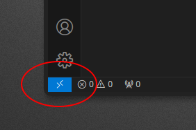

Choose the row that mentions 'SSH'

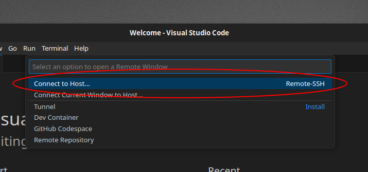


Select the entry corresponding to the IP address of your workstation VM

# 2. Set up Azure Function Core Tools

Going to install Azure Function Core Tools.  TODO: better descritpion.

Open a new terminal in the remote VSCode window:
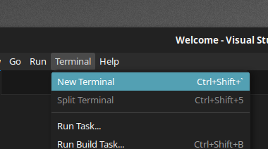

Run this: 
```bash
curl https://packages.microsoft.com/keys/microsoft.asc | gpg --dearmor > microsoft.gpg
sudo mv microsoft.gpg /etc/apt/trusted.gpg.d/microsoft.gpg
```

The first command should complete without errors, and the second shouldn't leave any output at all:

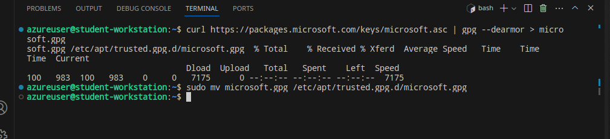

Now:

```bash
sudo sh -c 'echo "deb [arch=amd64] https://packages.microsoft.com/repos/microsoft-ubuntu-$(lsb_release -cs)-prod $(lsb_release -cs) main" > /etc/apt/sources.list.d/dotnetdev.list'
```

Complete without output

Now:
```bash
sudo apt-get update
```

And then: 
```bash
sudo apt-get install -y azure-cli azure-functions-core-tools-4
```

To confirm it was successful, you should be able to run this command and see a version number get printed out (it may vary from the screenshot below):

```bash
func --version
```

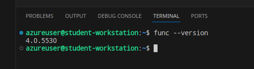

For future reference, the full documentation for how to install these tools on your own computer is [here](https://learn.microsoft.com/en-us/azure/azure-functions/functions-run-local)

# 3. Building our first web API


## Creating a starter project

```bash
mkdir ~/db-api
cd ~/db-api
```

```bash
func init --worker-runtime python
```

on success, we'll see it creates a bunch of files:

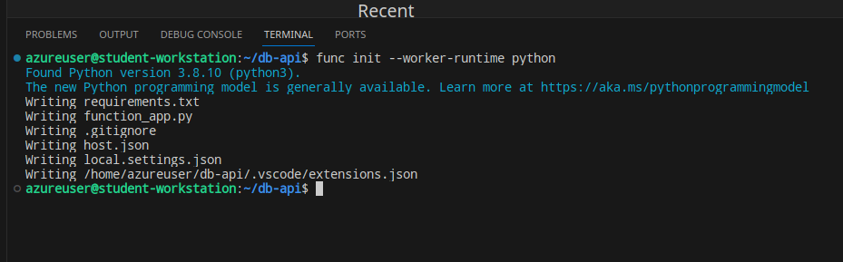

let's open this folder in VSCode now using the command:

```bash
code .
```

should see all these files in the files pane:


Now let's create a "venv" ("virtual environment") for the function to execute in. In a terminal, run this command to create a new environment:
```bash
python3 -m venv app-env
```

And now run this command to enter it:
```bash
source app-env/bin/activate
```
You should see the environment name appear before the regular stuff in the terminal prompt:

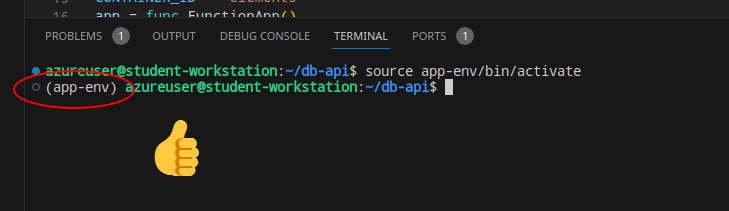

In general, you'll only need to create the environment once, but "activate"/**enter it every time you open a new terminal**. If you're not sure, look for that `(app-env)` text before the rest of the command prompt. If you don't see it, run that `activate` command above.


## Looking around

Open `function_app.py`

Right now, it does nothing:

```python
import azure.functions as func
import datetime
import json
import logging

app = func.FunctionApp()
```


We need to add a function that will get run when the user visits our webpage. The return value of the function will be what the user sees in their browser. Paste this at the bottom of the file:

```python

@app.route(route="test")
def test(req: func.HttpRequest) -> func.HttpResponse:
    logging.info('Python HTTP trigger function processed a request.')
    return func.HttpResponse(
         "Hey Galaxy",
         status_code=200
    )
```

Now in terminal:

```bash
func start
```

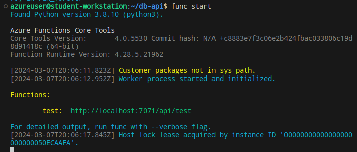

Test just for you :) . Try opening the URL it suggests in a web browser:

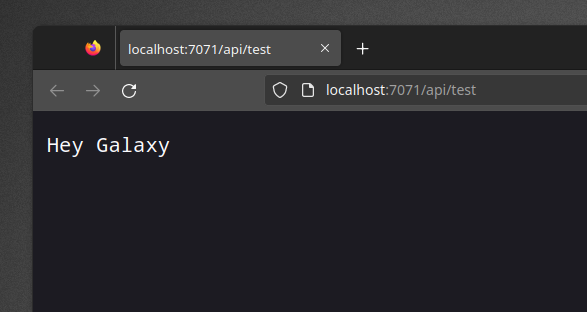

When you're done testing, go back to the terminal in VSCode and hit `Control + C` to turn off the test server. You'll see a red error message, which is fine:

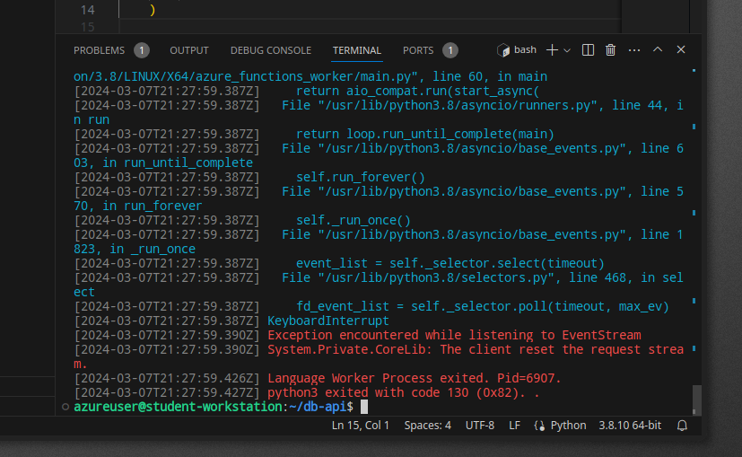

## Setting up our cloud app

Let's make it so anyone can see it.

On the Azure portal, open the Function Apps dashboard by searching for `Function Apps` at the top

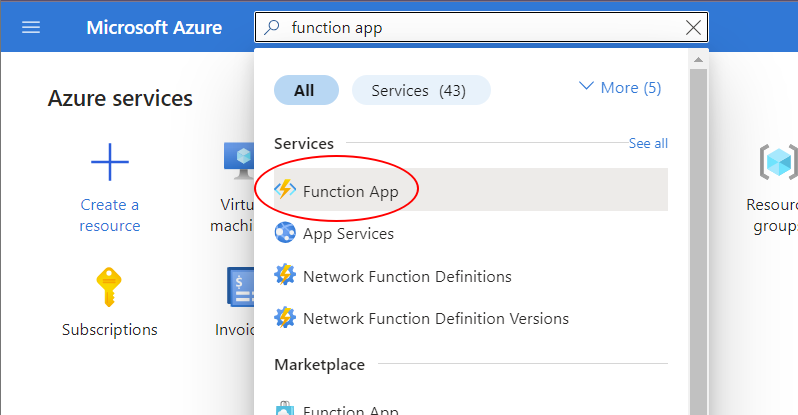

Then click create

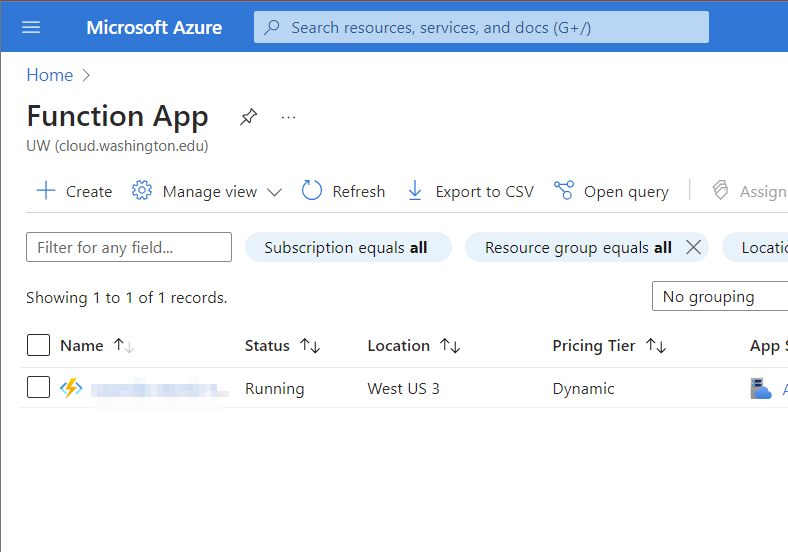

On the wizard page select the following options:
- **Subscription**: `MSE544_2024`
- **Resource gropu**: Whichever group has your UW NetID in its name
- **Function App name**: This is the name that will be in your app's web URL, so it has to be globally unique. Choose something like `______-atomic-portal`, where the blank `_______` is replaced with your UW NetID.
- **Runtime stack**: This is the programming language your function code is written in. Choose Python.
- **Version**: This is the version of the programming language your code was written in. We can leave it as whatever default is selected.
- **Region**: Choose the same region as you did for your database. This is likely `West US 3`.

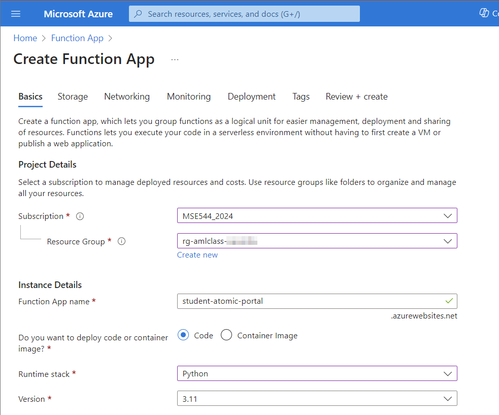

Then, at the bottom, click the blue `Review + Create` button, and then on the confirmation page, the blue `Create` button.

You'll be brought to a deployment page which, after a few minutes, should present you with a `Go to resource` button. Click that:
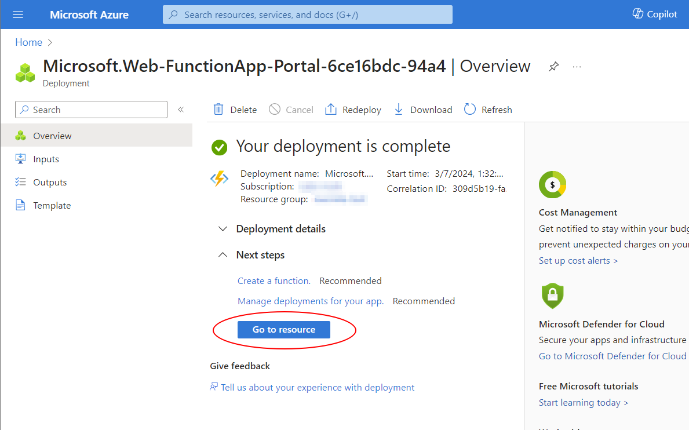

Hooray! We've set up our function app. Once we upload our code to it, we'll be able to run that code by following opening the circled URL in a web browser:

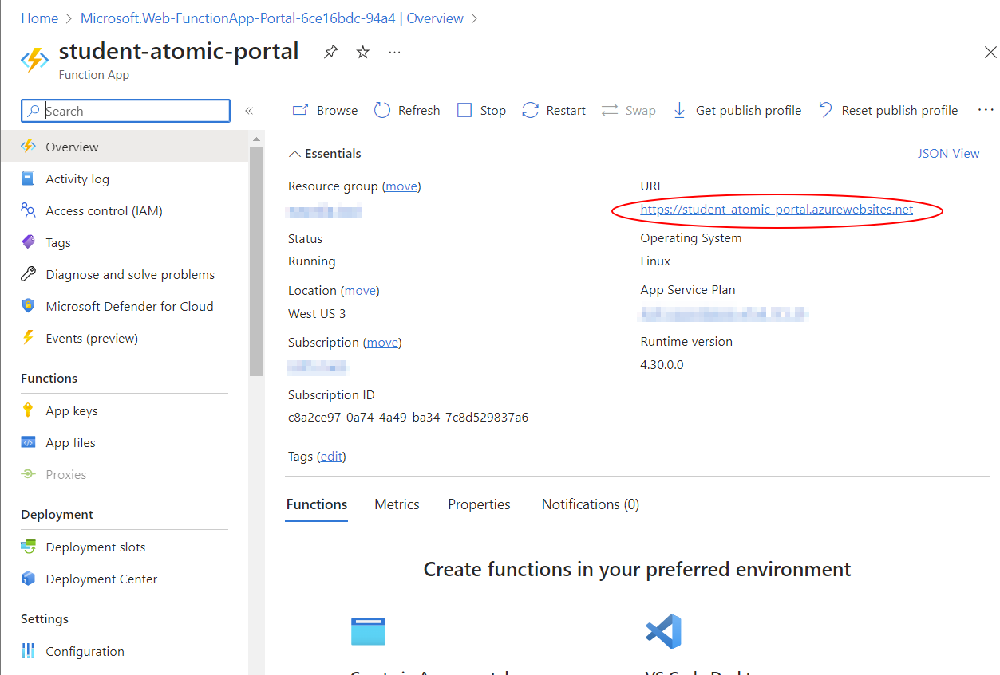

But for now, that should look like this:

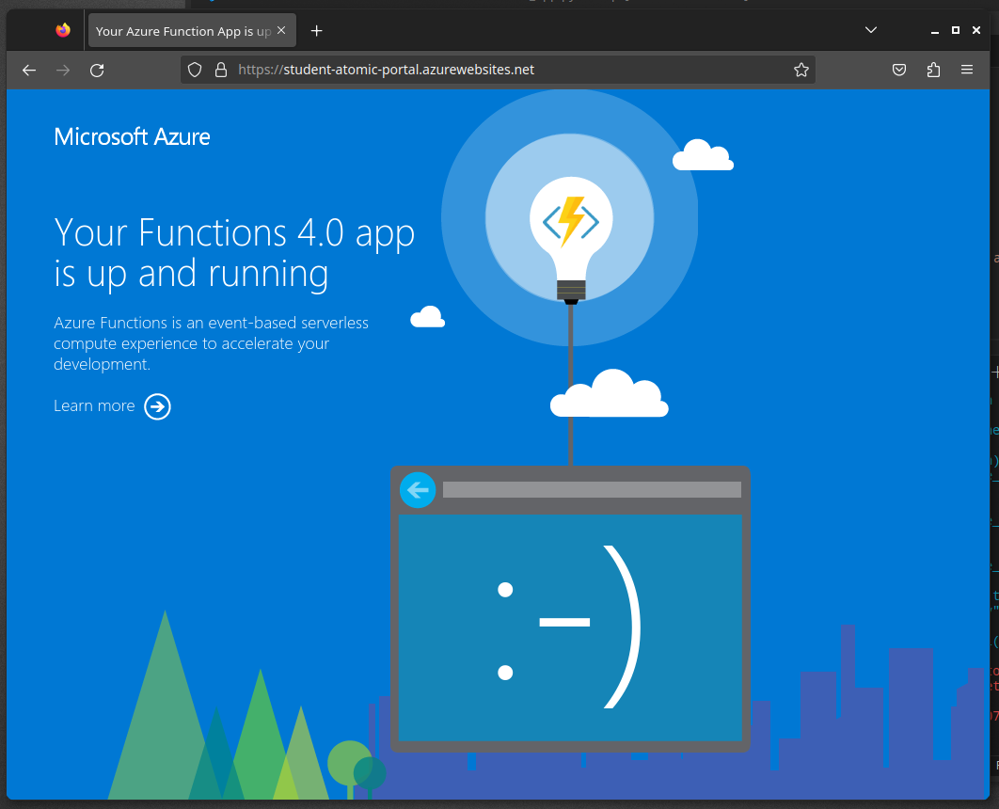

Now we have to upload our actual code to it..

## Deploying code to the cloud app


In VSCode terminal, log in by running this command and following the instructions it presents:

```bash
az login
```

When it finishes, you should see some garbage spat out to the terminal including your UW NetID:
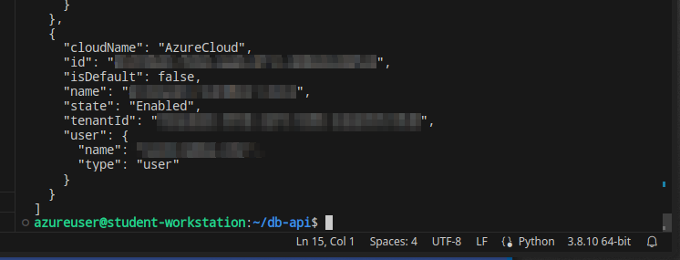

Now, publish your code by running the following command, where the blank `________` is replaced with the name of the function app you created in the web portal:

```bash
func azure functionapp publish ________
```

After a few minutes, if the process succeeds it should present you with a URL you can open in a web browser to run your function:

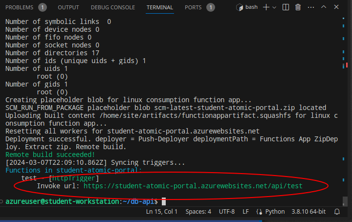

Trying that out in a web browser should lead to our `Hey Galaxy` page!

....Except that it doesn't work. What happened?

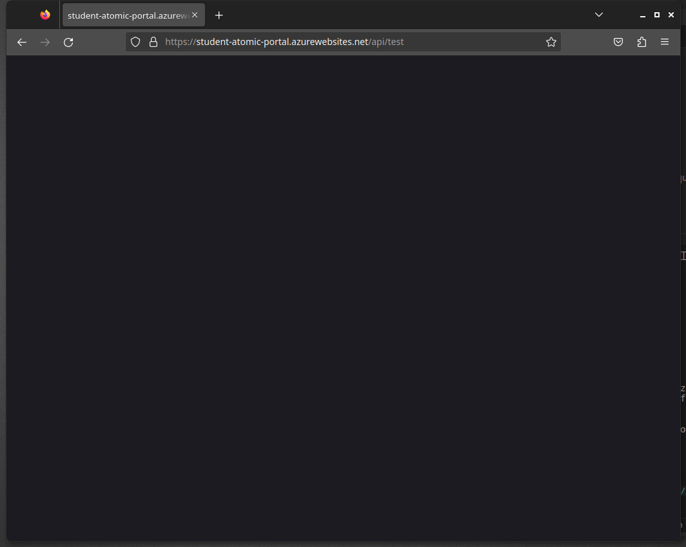

## Allowing annonymous requests

If we were to use more advanced tools to open that web URL, we'd find we were getting an error called `401 Unauthorized`. It turns out, by default, Azure function apps need users to be logged in or have access keys to use the functions we publish. This is because folks often use Azure functions to work with sensitive or private data, and want to make sure only authorized users are running their code.

But we don't care about that! We just want to allow the world to read our periodic table database. To do so, we have to change our function to allow *anonymous access*.

We can do this by changing the line of code that starts with `@app.route`. Change this:

```python
@app.route(route="test")
```

to this:

```python
@app.route(route="test", auth_level=func.AuthLevel.ANONYMOUS)
```

Test your function out with `func start`, and then once you confirm it still works, re-publish it with  `func azure functionapp publish ________` (blank replaced appropriately).


When the command completes, you should be able to run your code on the cloud by opening the invoke URL provided by the publish command:

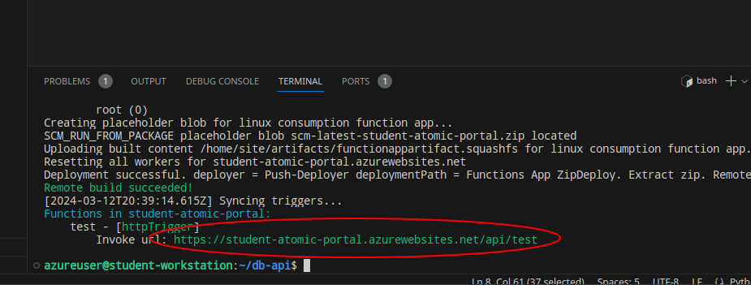

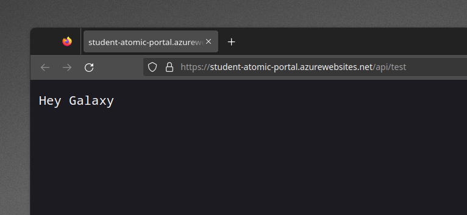

Your friends should be able to as well. Ask them to try it out!


# 4. Reading from the database

## New code 

Now we'll add another function to our API that allows users to perform element lookups from our NoSQL database.

First, let's open up `requirements.txt`, which lists the packages required for our code to run. Add the following two lines to the bottom, and save the file:

```python
azure-core==1.26.4
azure-cosmos==4.3.1
```

Open a terminal in the `db-api` folder and install these to our workstation VM by running the following command:

```bash
python3 -m pip install -r requirements.txt
```


Now return to `function_app.py`. Add this to the top of the file, right after the `import logging` line:
```python
import os
import azure.cosmos.cosmos_client as cosmos_client

try:
  HOST = os.environ['ACCOUNT_HOST']
  MASTER_KEY = os.environ['ACCOUNT_KEY']
except KeyError:
  logging.error("Get your database's account URL and key and set them in the ACCOUNT_HOST / ACCOUNT_KEY environment variables")
DATABASE_ID = "periodic-db"
CONTAINER_ID = "elements"
```

And at the bottom of the file, let's add the following functions:

```python

def stripPrivateKeys(structure):
    if hasattr(structure, "keys"):
        for key in list(structure.keys()):
            if hasattr(key, "startswith") and key.startswith("_"):
                del structure[key]
            else:
                stripPrivateKeys(structure[key])
    elif hasattr(structure, "__iter__") and not isinstance(structure, str):
        for elem in structure:
            stripPrivateKeys(elem)

@app.route(route="lookup", auth_level=func.AuthLevel.ANONYMOUS)
def lookup(req: func.HttpRequest) -> func.HttpResponse:
    element = req.params.get('name')
    if not element:
        try:
            req_body = req.get_json()
        except ValueError:
            pass
        else:
            element = req_body.get('name')

    if element:
        client = cosmos_client.CosmosClient(HOST, {'masterKey': MASTER_KEY})
        db = client.get_database_client(DATABASE_ID)
        container = db.get_container_client(CONTAINER_ID)
        items = list(container.query_items(
            query="SELECT * FROM r WHERE r.id=@id",
            parameters=[
                {"name": "@id", "value": element}
            ],
            enable_cross_partition_query=True
        ))
        stripPrivateKeys(items)
        items_json = json.dumps(items)
        return func.HttpResponse(
            items_json,
            mimetype="application/json",
            status_code=200
        )
    else:
        return func.HttpResponse(
             "Provide an element, honey..",
             status_code=404
        )

```

But we're still not done. We need to give our code the secret access keys to the database.

## Access credentials 

Open up `local.settings.json`, which should look something like this:

```json
{
  "IsEncrypted": false,
  "Values": {
    "FUNCTIONS_WORKER_RUNTIME": "python",
    "AzureWebJobsFeatureFlags": "EnableWorkerIndexing",
    "AzureWebJobsStorage": ""
  }
}
```

The settings contained between the curly braces in `"Values": {...}` are accessible in the Python code through those `os.environ` lines of code. Noting in our code that we grab the database's URI through a setting named `ACCCOUNT_HOST`, and key through a setting named `ACCOUNT_KEY`, we have to add those here.

Create two lines right after the opening curly brace `{` of "Values" (line 3 in the example above). On those lines, write:

```yaml
   "ACCOUNT_HOST": "______",
   "ACCOUNT_KEY": "______",
```

Now head over to the Azure web portal, and open up the Cosmos DB dashboard using the search box at the top. Select your database from the list:

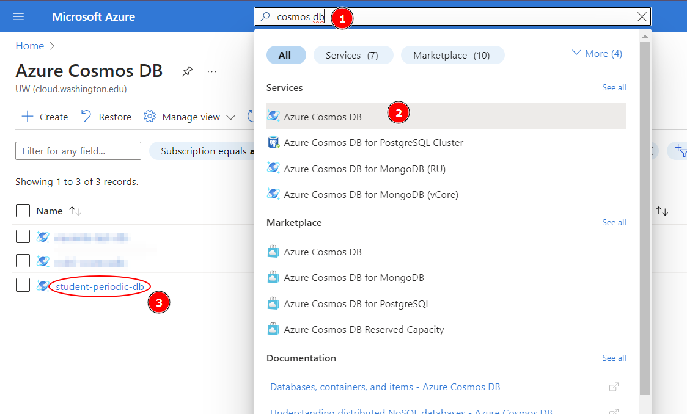

From there, select `Keys` in the left menu (1). Click the copy button next to the URI box (2) and paste it into `local.settings.json` as the `ACCOUNT_HOST` value, instead of the blank `______`. Click the eye icon to show the database's primary key (3), and then copy that too (4). Paste it into `local.settings.json` as the `ACCOUNT_KEY` value.

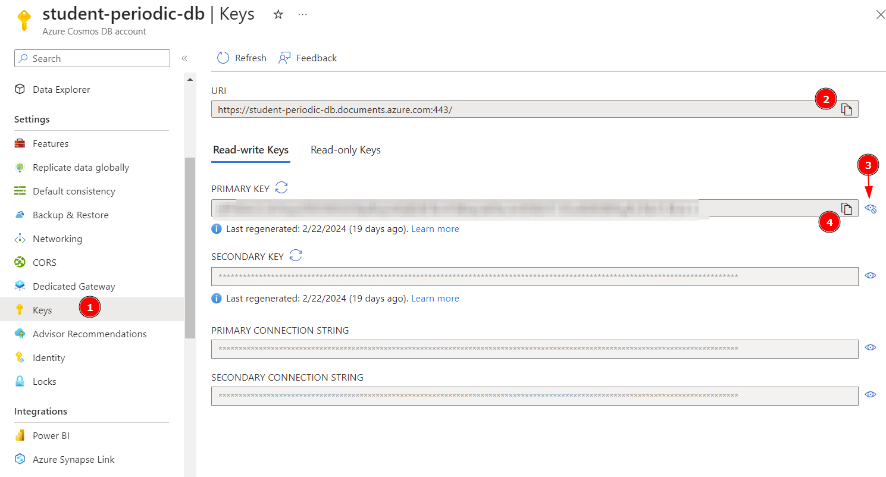

Save `local.settings.json`, and then test out your function by running the terminal command `func start`. We should be presented with _two_ URLs now, each corresponding to one of the python functions in `function_app.py`. We want to try the 'lookup' one:

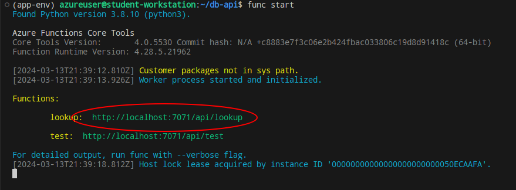

Open that in a web browser:

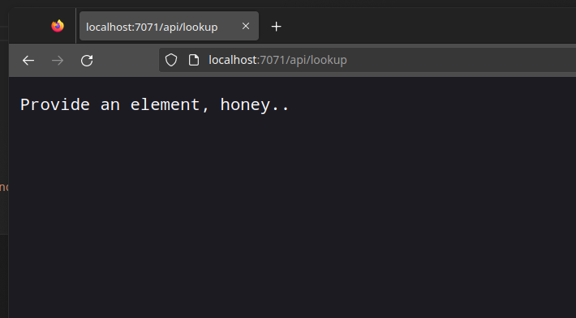

If you see the above, that's a great sign! Now let's look up a specific element. Try adding `?name=Carbon` to the end of the URL. If it works, you should see information like this:

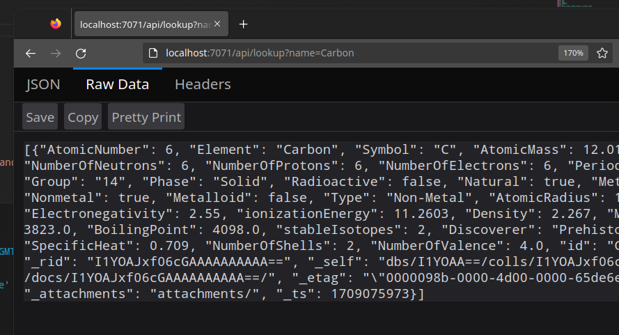

That means it works! Hurray! The exact formatting/coloring of the information will likely look different on your computer, but if the information is there, that's what we care about. If you __don't__ see information about carbon in your browser, (a) make sure it's capitalized, (b) look in the VSCode terminal for the red error output. This is the first information needed to debug the problem (which your classmates and course staff can help you with).

## Publishing

Push your code into the cloud with that old command,

```bash
func azure functionapp publish ________
```

(replacing the blank `______` appropriately). The process should complete and give us two URLs, but we're not ready to use them yet. We have to add the database URL/access key to the cloud environment, the same way we did in the test environment with `local.settings.json`. In your web browser, go to the function app's dashboard:

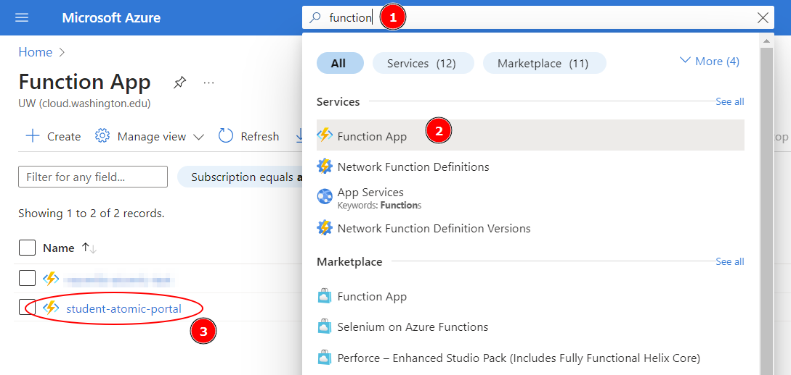

Select `Environment variables` from the `Settings` menu on the left. If it's not there, select `Configuration` instead (Microsoft is currently updating the menu organization, and unfortunately some users have the old version while others have the newer one). You ultimately want to end up at a table full of application settings, which should look something like this:

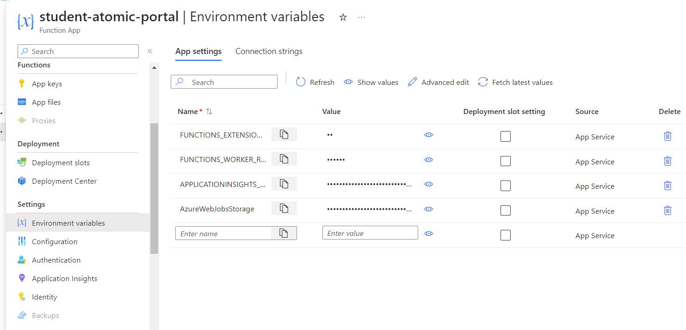

On this page, add two new variables named `ACCOUNT_HOST` and `ACCOUNT_KEY`. Give them the values of their respective variables from `local.settings.json`, but _not_ surrounded by double-quotes `"`.

When you're done, hit the blue `Apply` button at the bottom (or the `Save` button at the top, whichever your web portal seems to have) and confirm that you want to restart the app to make changes. _Now_, open the url `https://__________.azurewebsites.net/api/lookup?name=Carbon`, where the blank `_______` is replaced with your app name. You should see similar output to when you tested earlier:

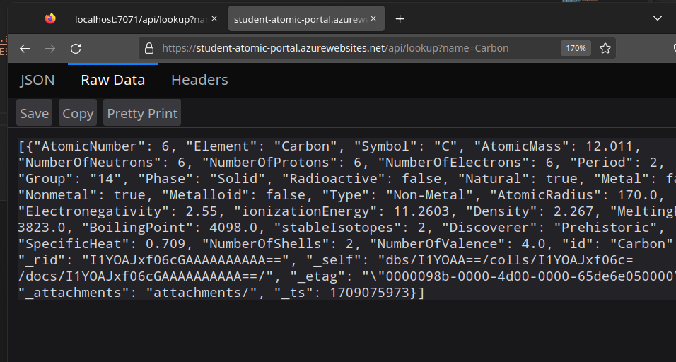

That means it all works! You've build an API that stores information in a database and retrieves it through a public web API. Congratulations!

{}

🏆 **Challenges:**
- Modify the Python code to support _partial_ name lookups (eg, looking up 'nit' will show information for Nitrogen) 
- Use HTML and Javascript to build a "front-end" for the API

{}