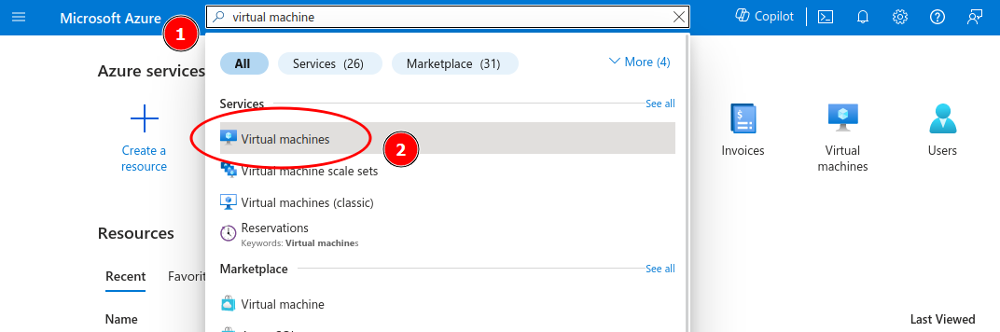
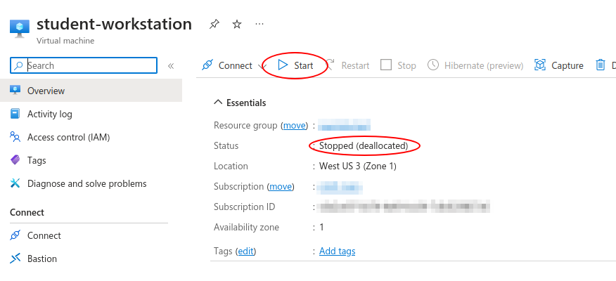
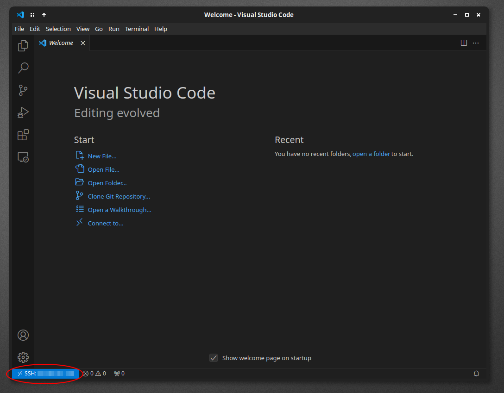
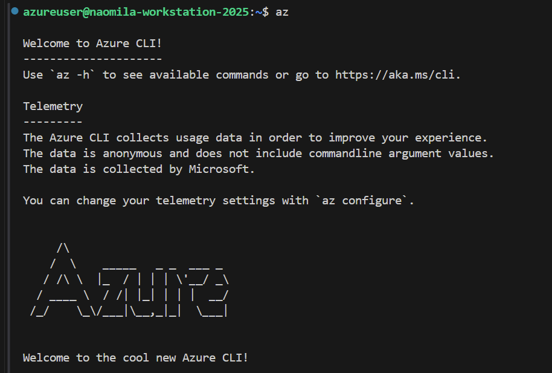
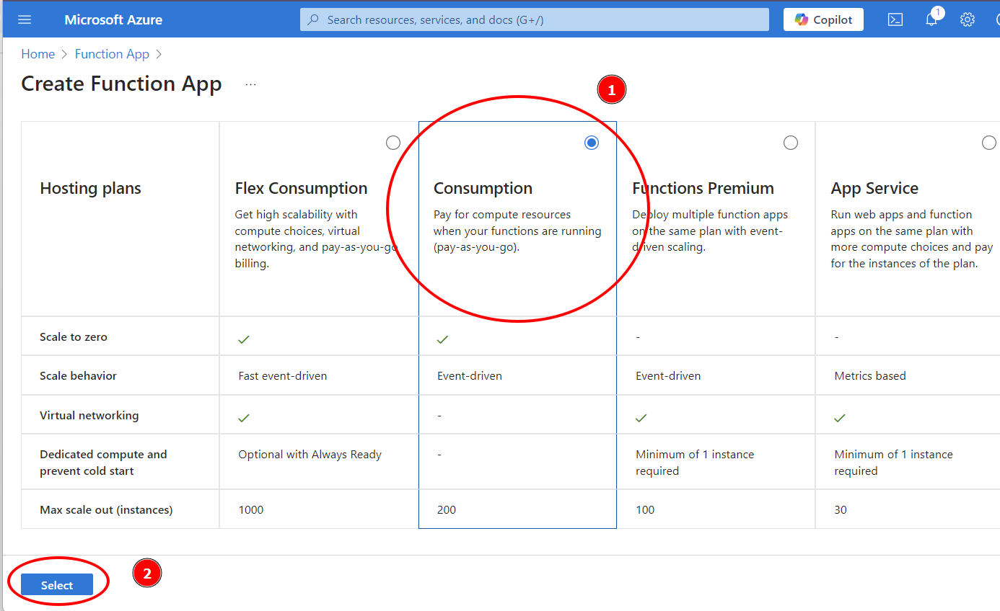

# 0. Introduction

In this tutorial we're going to build a **web API** ("application programming interface") to access information about the elements of the periodic table. A web API is very similar to a traditional website, but instead of formatting the pages for human readability, they are formatted to be easily read by computers and code. This is a very common way to make [all sorts of data](https://apilist.fun/) available.

Specifically, we're going to build our API using "**serverless functions**", which allow us to upload individual Python functions into the cloud and run them when someone goes to our API's web URL. The value returned by our code will be what the page loads on the visitor's computer. This has a few benefits for us:

* We are only charged money for the seconds that the code is running. The alternative is to leave a VM with our Python script on 24/7 in case someone visits our API (a "server"). That costs a _lot more_ money. 
* By making data available through an API, we can write code that controls who has access to it and when. Our API today is going to be public, but to control the cost of providing it we could limit access to users with unique IDs and bill them for their usage. This is common practice for [scientific APIs](https://sciencegateways.org/) with big cloud bills and limited funds.
* We can store the access keys to our internal database safely in our cloud code, which the public will never hace access to. They can see the results of our code, but not the code itself!

This guide assumes that you've completed the [VM Workstation tutorial](../workstation) and [NoSQL](../nosql). If you haven't, go back and skim through those now. Using a remote VM is not required to do any of the things outlined in this tutorial, but it _will_ make it easier for course staff to help you debug things. If you were unable to complete the NoSQL tutorial, you can use the databases that your classmates or course staff made; just ask them for the appropriate URI and access key (this tutorial will remind you when you get to that point).

# 1. Get your environment ready

## Portal and workstation

We'll start by making sure our workstation VM is turned on. Open a web browser and log in to the Azure web portal.

{}
🔗 [https://portal.azure.com](https://portal.azure.com)
{}

Go to the virtual machines dashboard by using the search bar at the top:



Select your workstation VM from the list, and if it's stopped, click the `Start` button:



Keep this window open in the background, we'll be using it again in a minute.

## VSCode

Open VSCode and make sure your window is remotely connected to your cloud virtual machine. If it is, you'll see the VM's public IP address in the bottom left blue box:



If not, click the blue `><` button and open an SSH connection to the workstation as shown [in the workstation tutorial](../workstation/#4-opening-a-remote-vscode-window). 


{}
⛔ **Having trouble with your VM?** ⛔

If you can't connect VSCode to your VM, check out these troubleshooting guides from the Workstation tutorial:

- [VSCode can connect, but keeps freezing up](../workstation/#freezing-up-mid-work)
- [VSCode can't connect at all: Error “Permission denied (publickey)”](../workstation/#error-permission-denied-publickey)
- [VSCode can't connect at all: Error “The connection timed out”](../workstation/#taking-a-long-time-to-connect)

{}


# 2. Set up Azure Function Core Tools

Azure provides us with an application called "Azure Function Core Tools" that we can install on our workstation VM (or personal computer) to test out our API code before actually publishing it. The core tools will let us invoke our Python code from a web browser, but using a private URL that _only_ browsers on our workstation VM (or personal computer) can access.

To install Azure Function Core Tools, start by opening a new terminal in the remote VSCode window:


We'll start by installing the "Azure CLI," which provides some useful commands in our terminal for interacting with Azure. Run this command:

```bash
curl -sL https://aka.ms/InstallAzureCLIDeb | sudo bash
```

It should output a bunch of junk. If it was successful, you should be able to run this command:

```bash
az
```

and see output like this:



Now we'll install the Function Core Tools. Run these commands to install Microsoft's code signing key to your VM. This helps us confirm that any Microsoft-provided tools we install are free of viruses or malware:

```bash
curl https://packages.microsoft.com/keys/microsoft.asc | gpg --dearmor > microsoft.gpg
sudo mv microsoft.gpg /etc/apt/trusted.gpg.d/microsoft.gpg
```

The first command should complete without errors, and the second shouldn't leave any output at all:


Now, run this command to let the `apt` tool, which we use to install software, know about Microsoft's software. The command should complete without output:

```bash
sudo sh -c 'echo "deb [arch=amd64] https://packages.microsoft.com/repos/microsoft-ubuntu-$(lsb_release -cs 2>/dev/null)-prod $(lsb_release -cs 2>/dev/null) main" > /etc/apt/sources.list.d/dotnetdev.list'
```

Finally, run these two commands to install the core tools:

```bash
sudo apt-get update
sudo apt-get install -y azure-functions-core-tools-4
```

To confirm it was successful, you should be able to run the core tools with the `func` command and see a version number get printed out (it may vary from the screenshot below):

```bash
func --version
```


For future reference, the full documentation for how to install these tools on your own computer is [here](https://learn.microsoft.com/en-us/azure/azure-functions/functions-run-local).

# 3. Building our first web API


## Creating a starter project

Let's make a new folder to keep our function code in. Make a directory `db-api` and move into it with these terminal commands:

```bash
mkdir ~/db-api
cd ~/db-api
```

Then, use the core tools to create a new Python project:

```bash
func init --worker-runtime python
```

On success, we'll see it creates a bunch of files:


Let's open this folder in VSCode now using the command:

```bash
code .
```

This should let us see all the project files in the left sidebar:


Now let's create a Python "venv" to do our development in. In a new terminal

```bash
python3 -m venv app-env
```

And now run this command to enter it:
```bash
source app-env/bin/activate
```
You should see the environment name appear before the regular stuff in the terminal prompt:


As a reminder from our dance with "venvs" in the NoSQL tutorial, you'll only need to create the environment once, but you might need to "activate" it every time you open a new terminal. If you're not sure, look for that `(app-env)` text before the rest of the command prompt. If you don't see it, run that `activate` command above.

## Looking around

Our Python code is ultimately going to be stored in `function_app.py`. Double-click it in the file bar on the left to open it.

Right now, it does nothing:

```python
import azure.functions as func
import datetime
import json
import logging

app = func.FunctionApp()
```

Let's add a function that will run when users visit a page called `test` on our website. To do so we'll define a Python function called `test`, and annotate it with a line that defines it as the **route** for the URL `test`.

Paste this at the bottom of the file:

```python

@app.route(route="test")
def test(req: func.HttpRequest) -> func.HttpResponse:
    logging.info('Python HTTP trigger function processed a request.')
    return func.HttpResponse(
         "Hey Galaxy",
         status_code=200
    )
```

That `@app.route` line is what connects web browsers visiting `http://www.example.com/api/test` to the Python function `test`. The `logging.info` line prints a message to our private terminal window, but the message won't be seen by visitors to the web URL. The only thing the web visitor will see is the text "Hey Galaxy" (the result of the `return` statement), and the status code `200`, which in web world represents "success" 🎊🎉. For a list of all the status codes, and what they mean, look [here](https://developer.mozilla.org/en-US/docs/Web/HTTP/Status).

Now in terminal, let's start the server with this command:

```bash
func start
```


As long as this command is running, we should be able to visit the URLs it provides. Try opening the 'test' route in a web browser:


When you're done testing, go back to the terminal in VSCode and hit `Control + C` to turn off the test server. You'll see a red error message, which is fine:


## Setting up our cloud app

Let's make publish our function to the cloud so anyone can run it.

On the Azure portal, open the Function Apps dashboard by searching for `Function Apps` at the top:


From this dashboard, click `+ Create`:


We'll be presented with several different "hosting plans," which trade off things like how many people can be accessing our data at once and how fast those interactions happen. Our API is going to be tragically unpopular, so let's select the cheapest option, `Consumption` (1), and then continue with the `Select` button (2):



On the wizard page select the following options:
- **Subscription**: Your course staff should announce to you what subscription to use. If you're not sure, ask them.
- **Resource group**: Choose the resource group that contains your UW NetID in its name
- **Function App name**: This is the name that will be in your app's web URL, so it has to be globally unique. Choose something like `______-atomic-portal`, where the blank `_______` is replaced with your UW NetID.
- **Runtime stack**: This is the programming language your function code is written in. Choose Python.
- **Version**: This is the version of the programming language your code was written in. We can leave it as whatever default is selected.
- **Region**: Choose the same region as you did for your [NoSQL database](../nosql).


Then, at the bottom, click the blue `Review + Create` button, and then on the confirmation page, the blue `Create` button.

You'll be brought to a deployment page which, after a few minutes, should present you with a `Go to resource` button. Click that:


Hooray! We've set up our function app. Once we upload our code to it, we'll be able to run that code by following opening the circled URL in a web browser:


But for now, that should look like this:


Now we have to upload our actual code to it..

## Deploying code to the cloud app


In VSCode terminal, log in by running this command and following the instructions it presents:

```bash
az login
```
You may be asked to select the subscription you want to log into. Type the number in the list that corresponds to the Azure subscription your course staff tell you to use:


When it finishes, try running this command:

```bash
az account show
```

If you've successfully logged in, you should see some garbage spat out to the terminal including your UW NetID:


If you _don't_ see the above, contact your course staff and make sure you can log in through the CLI before proceeding.

Now, publish your code by running the following command, where the blank `________` is replaced with the name of the function app you created in the web portal:

```bash
func azure functionapp publish ________
```

After a few minutes, if the process succeeds it should present you with a URL you can open in a web browser to run your function:


Trying that out in a web browser should lead to our `Hey Galaxy` page!

....Except that it doesn't work. What happened?


## Allowing annonymous requests

If we were to use more advanced tools to open that web URL, we'd find we were getting an error called [`401 Unauthorized`](https://developer.mozilla.org/en-US/docs/Web/HTTP/Status/401). It turns out, by default, Azure function apps need users to be logged in or have access keys to use the functions we publish. This is because folks often use Azure functions to work with sensitive or private data, and want to make sure only authorized users are running their code.

But we don't care about that! We just want to allow the world to read our periodic table database. To do so, we have to change our function to allow *anonymous access*.

We can do this by changing the line of code that starts with `@app.route`. Change this:

```python
@app.route(route="test")
```

to this:

```python
@app.route(route="test", auth_level=func.AuthLevel.ANONYMOUS)
```

Test your function out with `func start`, and then once you confirm it still works, re-publish it with  `func azure functionapp publish ________` (blank replaced appropriately).


When the command completes, you should be able to run your code on the cloud by opening the invoke URL provided by the publish command:


Your friends should be able to as well. Ask them to try it out!


# 4. Reading from the database

## New code

Now we'll add another function to our API that allows users to perform element lookups from our NoSQL database.

First, let's open up `requirements.txt` which, as in the NoSQL tutorial, lists the packages required for our code to run. Add the following two lines to the bottom, and save the file:

```python
azure-core
azure-cosmos
```

In the terminal, make sure we're in the `db-api` folder and that our virtual environment is activated. Then, run the following command:

```bash
python3 -m pip install -r requirements.txt
```

Now return to `function_app.py`. Add this to the top of the file, right after the `import logging` line:
```python
import os
import azure.cosmos.cosmos_client as cosmos_client

# Load secret database keys from the working environment
try:
  HOST = os.environ['ACCOUNT_HOST']
  MASTER_KEY = os.environ['ACCOUNT_KEY']
except KeyError:
  logging.error("Get your database's account URL and key and set them in the ACCOUNT_HOST / ACCOUNT_KEY environment variables")

# Identify the database and container we want to read from
DATABASE_ID = "periodic-db"
CONTAINER_ID = "elements"
```

And at the bottom of the file, let's add the following functions:

```python

def stripPrivateKeys(structure):
    """
    Given a NoSQL database entry, remove any internal pieces of data
    whose names start with an underscore '_'. This function will
    search through nested dictionaries and lists. It modifies the
    'structure' input in-place. For us, this means the copy of the
    data in Python world gets changed (the copy in the database stays
    the same).
    """
    if hasattr(structure, "keys"):
        for key in list(structure.keys()):
            if hasattr(key, "startswith") and key.startswith("_"):
                del structure[key]
            else:
                stripPrivateKeys(structure[key])
    elif hasattr(structure, "__iter__") and not isinstance(structure, str):
        for elem in structure:
            stripPrivateKeys(elem)

# Add a new API route called "lookup" to look up an element's information
# by its name:
@app.route(route="lookup", auth_level=func.AuthLevel.ANONYMOUS)
def lookup(req: func.HttpRequest) -> func.HttpResponse:
    # Get the "name" input from the URL (or request body, if it's not
    # in the url):
    element = req.params.get('name')
    if not element:
        try:
            req_body = req.get_json()
        except ValueError:
            pass
        else:
            element = req_body.get('name')

    if element:
        # An element name was provided!

        # Open a database connection
        client = cosmos_client.CosmosClient(HOST, {'masterKey': MASTER_KEY})
        db = client.get_database_client(DATABASE_ID)
        container = db.get_container_client(CONTAINER_ID)

        # Do a database query that fetches all database entries
        # with the provided element name. In theory, this should
        # only be one element, but in general SQL queries can
        # return more than one object, so we get a list. It's just
        # that the list will almost always contain only one element.
        items = list(container.query_items(
            query="SELECT * FROM r WHERE r.id=@id",
            parameters=[
                {"name": "@id", "value": element}
            ],
            enable_cross_partition_query=True
        ))

        # Strip out internal database keys that have nothing
        # to do with the chemical data itself
        stripPrivateKeys(items)

        # Turn the element data into a string using the "json"
        # library, and return it to the user
        items_json = json.dumps(items)
        return func.HttpResponse(
            items_json,
            mimetype="application/json",
            status_code=200
        )
    else:
        # No element was provided, return an error message
        return func.HttpResponse(
             "Provide an element, honey..",
             status_code=404
        )

```

Serverless functions are able to receive input data through "URL parameters", similar to how normal Python functions have input parameters after their parantheses (eg, the "hello" in `print("hello")`). That said, they're structured a little differently. The person running the code, by visiting the API's URL in a web browser, needs to provide values by putting them at the end of the URL, in this format:

```bash
http://example.com/api/route?name1=value1&name2=value2&name3=value3...
```

These values are called an **argument list**. The argument list always goes at the end of the URL, and starts with a `?`. After that, the input parameter's name, an `=` sign, and then input data itself. If there are further values that need to be provided, they're chained together with `&`s.

On the Python side, these values can be found inside the function's `req` input. We can see the code retrieving the value of a parameter called `name` with the code `req.params.get('name')`.

So, to look up the element Carbon, you would type out a URL like this:
```bash
http://__________/api/lookup?name=Carbon
```
Where the blank `______` is replaced with the proper begnning of your function app's URL.

But we're not ready to test it just yet. We need to give our code the secret access keys to the database.

## Access credentials

Open up `local.settings.json`, which should look something like this:

```json
{
  "IsEncrypted": false,
  "Values": {
    "FUNCTIONS_WORKER_RUNTIME": "python",
    "AzureWebJobsFeatureFlags": "EnableWorkerIndexing",
    "AzureWebJobsStorage": ""
  }
}
```

The settings contained between the curly braces in `"Values": {...}` are accessible in the Python code through those `os.environ` lines of code. Noting in our code that we grab the database's URI through a setting named `ACCCOUNT_HOST`, and key through a setting named `ACCOUNT_KEY`, we have to add those here.

Create two lines right after the opening curly brace `{` of "Values" (line 3 in the example above). On those lines, write:

```yaml
   "ACCOUNT_HOST": "______",
   "ACCOUNT_KEY": "______",
```

Now head over to the Azure web portal, and open up the Cosmos DB dashboard using the search box at the top. Select your database from the list:


From there, select `Keys` in the left menu (1). Click the copy button next to the URI box (2) and paste it into `local.settings.json` as the `ACCOUNT_HOST` value, instead of the blank `______`. Click the eye icon to show the database's primary key (3), and then copy that too (4). Paste it into `local.settings.json` as the `ACCOUNT_KEY` value.


Save `local.settings.json`, and then test out your function by running the terminal command `func start`. We should be presented with _two_ URLs now, each corresponding to one of the python functions in `function_app.py`. We want to try the 'lookup' one:


Open that in a web browser:


If you see the above, that's a great sign! Now let's look up a specific element. Try adding `?name=Carbon` to the end of the URL. If it works, you should see information like this:


That means it works! Hurray! The exact formatting/coloring of the information will likely look different on your computer, but if the information is there, that's what we care about. If you __don't__ see information about carbon in your browser, (a) make sure it's capitalized, (b) look in the VSCode terminal for the red error output. This is the first information needed to debug the problem (which your classmates and course staff can help you with). Your course staff can help you with the rest.

## Publishing

Once we get the local testing version of the API route working, push it into the cloud with this command:

```bash
func azure functionapp publish ________
```

(replacing the blank `______` appropriately). The process should complete and give us two URLs, but we're not ready to use them yet. We have to add the database URL/access key to the cloud environment, the same way we did in the test environment with `local.settings.json`. In your web browser, go to the function app's dashboard:


Select `Environment variables` from the `Settings` menu on the left. If it's not there, select `Configuration` instead (Microsoft is currently updating the menu organization, and unfortunately some users have the old version while others have the newer one). You ultimately want to end up at a table full of application settings, which should look something like this:


On this page, add two new variables named `ACCOUNT_HOST` and `ACCOUNT_KEY`. Give them the values of their respective variables from `local.settings.json`, but _not_ surrounded by double-quotes `"`.

When you're done, hit the blue `Apply` button at the bottom (or the `Save` button at the top, whichever your web portal seems to have) and confirm that you want to restart the app to make changes. _Now_, open the url `https://__________.azurewebsites.net/api/lookup?name=Carbon`, where the blank `_______` is replaced with your app name. You should see similar output to when you tested earlier:


That means it all works! You've built an API that stores information in a database and retrieves it through a public web API. Congratulations!

{}

🏆 **Challenges:**
- Modify the Python code to support _partial_ name lookups (eg, looking up 'nit' will show information for Nitrogen) 
- Use HTML and Javascript to build a "front-end" for the API

{}