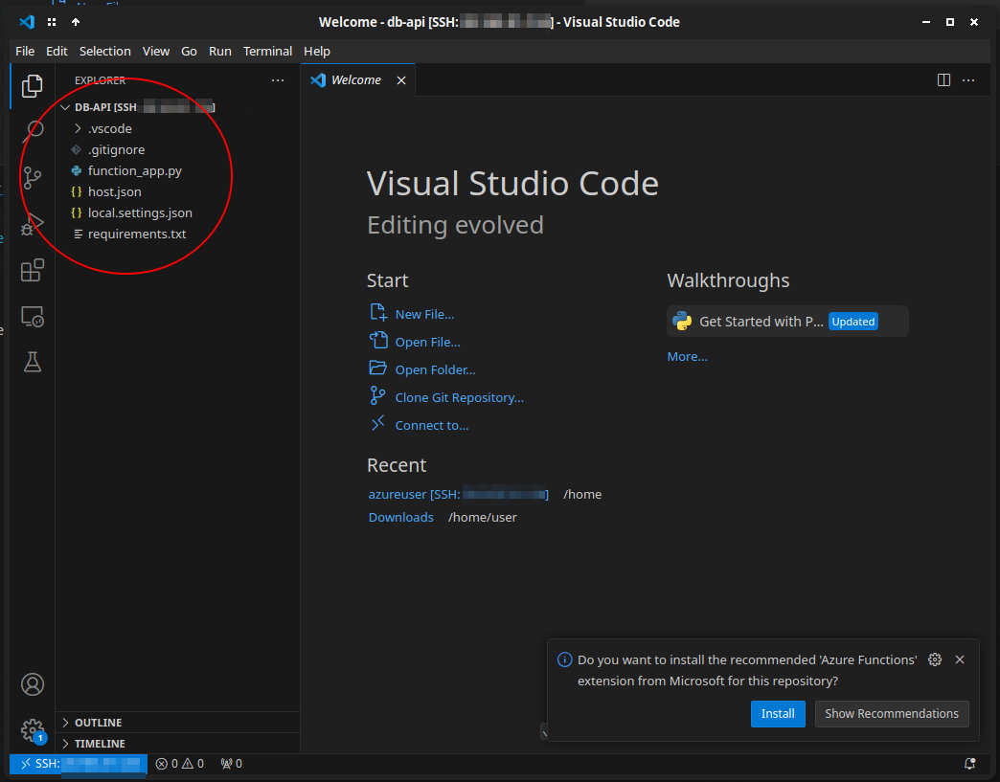

# 0. Introduction

In this tutorial TODO

This guide assumes that you've completed the [VM Workstation tutorial](../workstation) and [NoSQL](../nosql). If you haven't, go back and skim through those now. Using a remote VM is not required to do any of the things outlined in this tutorial, but it _will_ make it easier for course staff to help you debug things. If you were unable to complete the NoSQL tutorial, you can use the databases that your classmates or course staff made; just ask them for the appropriate URI and access key (this tutorial will remind you when you get to that point).

# 1. Get your environment ready

## Portal

TODO description

{}
🔗 [https://portal.azure.com](https://portal.azure.com)
{}

## VSCode

Make sure your workstation VM is started

In VSCode, click the `><` button in the bottom-left


Choose the row that mentions 'SSH'


Select the entry corresponding to the IP address of your workstation VM

# 2. Set up Azure Function Core Tools

Going to install Azure Function Core Tools.  TODO: better descritpion.

Open a new terminal in the remote VSCode window:


Run this: 
```bash
curl https://packages.microsoft.com/keys/microsoft.asc | gpg --dearmor > microsoft.gpg
sudo mv microsoft.gpg /etc/apt/trusted.gpg.d/microsoft.gpg
```

The first command should complete without errors, and the second shouldn't leave any output at all:


Now:

```bash
sudo sh -c 'echo "deb [arch=amd64] https://packages.microsoft.com/repos/microsoft-ubuntu-$(lsb_release -cs)-prod $(lsb_release -cs) main" > /etc/apt/sources.list.d/dotnetdev.list'
```

Complete without output

Now:
```bash
sudo apt-get update
```

And then: 
```bash
sudo apt-get install -y azure-cli azure-functions-core-tools-4
```

To confirm it was successful, you should be able to run this command and see a version number get printed out (it may vary from the screenshot below):

```bash
func --version
```


For future reference, the full documentation for how to install these tools on your own computer is [here](https://learn.microsoft.com/en-us/azure/azure-functions/functions-run-local)

# 3. Building our first web API


## Creating a starter project

```bash
mkdir ~/db-api
cd ~/db-api
```

```bash
func init --worker-runtime python
```

on success, we'll see it creates a bunch of files:


let's open this folder in VSCode now using the command:

```bash
code .
```

should see all these files in the files pane:



## Looking around

Open `function_app.py`

Right now, it does nothing:

```python
import azure.functions as func
import datetime
import json
import logging

app = func.FunctionApp()
```


We need to add a function that will get run when the user visits our webpage. The return value of the function will be what the user sees in their browser. Paste this at the bottom of the file:

```python

@app.route(route="test")
def test(request: func.HttpRequest) -> func.HttpResponse:
    logging.info('Python HTTP trigger function processed a request.')
    return func.HttpResponse(
         "Hey Galaxy",
         status_code=200
    )
```

Now in terminal:

```bash
func start
```


Test just for you :) . Try opening the URL it suggests in a web browser:


When you're done testing, go back to the terminal in VSCode and hit `Control + C` to turn off the test server. You'll see a red error message, which is fine:


## Setting up our cloud app

Let's make it so anyone can see it.

On the Azure portal, open the Function Apps dashboard by searching for `Function Apps` at the top


Then click create


On the wizard page select the following options:
- **Subscription**: `MSE544_2024`
- **Resource gropu**: Whichever group has your UW NetID in its name
- **Function App name**: This is the name that will be in your app's web URL, so it has to be globally unique. Choose something like `______-atomic-portal`, where the blank `_______` is replaced with your UW NetID.
- **Runtime stack**: This is the programming language your function code is written in. Choose Python.
- **Version**: This is the version of the programming language your code was written in. We can leave it as whatever default is selected.
- **Region**: Choose the same region as you did for your database. This is likely `West US 3`.


Then, at the bottom, click the blue `Review + Create` button, and then on the confirmation page, the blue `Create` button.

You'll be brought to a deployment page which, after a few minutes, should present you with a `Go to resource` button. Click that:


Hooray! We've set up our function app. Once we upload our code to it, we'll be able to run that code by following opening the circled URL in a web browser:


But for now, that should look like this:


Now we have to upload our actual code to it..

## Deploying code to the cloud app


In VSCode terminal, log in by running this command and following the instructions it presents:

```bash
az login
```

When it finishes, you should see some garbage spat out to the terminal including your UW NetID:


Now, publish your code by running the following command, where the blank `________` is replaced with your UW NetID:

```bash
func azure functionapp publish ________
```

After a few minutes, if the process succeeds it should present you with a URL you can open in a web browser to run your function:


Trying that out in a web browser should lead to our `Hey Galaxy` page!

....Except that it doesn't work. What happened?


## Allowing annonymous requests

If we were to use more advanced tools to open that web URL, we'd find we were getting an error called `401 Unauthorized`. It turns out, by default, Azure function apps need users to be logged in or have access keys to use the functions we publish. This is because folks often use Azure functions to work with sensitive or private data, and want to make sure only authorized users are running their code.

But we don't care about that! We just want to allow the world to read our periodic table database. To do so, we have to change our function to allow *anonymous access*.


# 4. Connecting your function to the database

{}


🏆 **Challenge:**
- haHA
- frontend?

{}