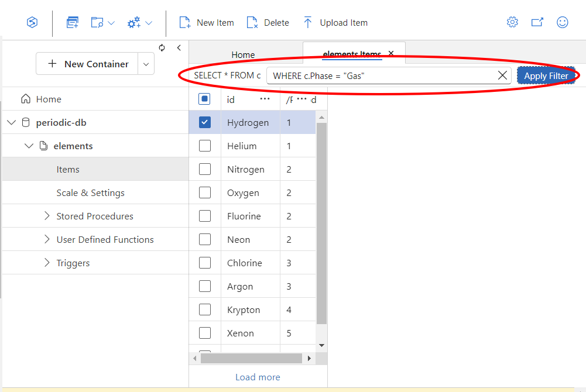

# 0. Introduction

In this tutorial we will set up a database and fill it with records containing information about the periodic table of elements. In a subsequent tutorial, we'll build an API for the public to access this database (without needing to log in to your Azure account 😉).

Specifically, we'll be using a NoSQL database (pronounced "no-seek-well") using Azure's "CosmosDB" service. NoSQL databases are great ways to store 

This guide assumes that you've completed the [VM Workstation tutorial](../workstation). If you haven't, go back and skim through it now. Using a remote VM is not required to do any of the things outlined in this tutorial, but it _will_ make it easier for course staff to help you debug things.

# 1. Get your environment ready

## Portal and workstation

We'll start by making sure our workstation VM is turned on. Open a web browser and log in to the Azure web portal.

{}
🔗 [https://portal.azure.com](https://portal.azure.com)
{}

Go to the virtual machines dashboard by using the search bar at the top:


Select your workstation VM from the list, and if it's stopped, click the `Start` button:


Keep this window open in the background, we'll be using it again in a minute.

## VSCode

Open VSCode and make sure your window is remotely connected to your cloud virtual machine. If it is, you'll see the VM's public IP address in the bottom left blue box:


If not, click the blue `><` button and open an SSH connection to the workstation as shown [in the workstation tutorial](../workstation/#4-opening-a-remote-vscode-window). 

{}
⛔ **Having trouble with your VM?** ⛔

If you can't connect VSCode to your VM, check out these troubleshooting guides from the Workstation tutorial:

- [VSCode can connect, but keeps freezing up](../workstation/#freezing-up-mid-work)
- [VSCode can't connect at all: Error “Permission denied (publickey)”](../workstation/#error-permission-denied-publickey)
- [VSCode can't connect at all: Error “The connection timed out”](../workstation/#taking-a-long-time-to-connect)

{}

# 2. Create an empty database

Now we're ready to create our database!

Go back to the web portal and search for `Cosmos`. Open up the dashboard for `Azure Cosmos DB`:


From here, create a new database by clicking the `+ Create` button:


Azure supports a number of different database technologies, all of which are provided with the brand name "Cosmos DB". Today, we'll be makind a NoSQL document store, which they call "Cosmos DB for NoSQL". Click the `Create` button under the `Cosmos DB for NoSQL` heading:


We'll be presented with a configuration page to select various database options. Choose the following:

- **Subscription**: Your course staff should announce to you what subscription to use. If you're not sure, ask them.
- **Resource group**: Choose the pre-existing resource group that contains your UW NetID in the name. It will look something like `rg-amlclass-[YOUR UW NETID]`.
- **Account Name**: Name your account `______-periodic-db`, where the blank `_______` is replaced with your UW NetID. In general, the account can be named whatever we want, but this format makes it easier for course staff to keep track of.
- Location: The general rule here is to place your database in the same location as the VMs and other resources that access it -- this can make database accesses faster, and in some cases make things cheaper. For us, though, it doesn't matter. Leave it with its default value.
- Apply Free Tier Discount: Do **Not** Apply


When you're done, click `Next: Global Distribution >` at the bottom.

On this page, choose the following options:
- **Geo-Redundancy**: Disable. This option requests that Azure backs our data up in different physical locations around the world. Though good practice for important data, our exercise today isn't that important ;) .
- **Multi-region Writes**: Disable

When you're done, click `Next: Networking >`.

There are no options we need to change here, but in general, this is how we would **limit database access to the outside world**. This is really important if our database stored personal data for human beings, or trade secrets for our employer. In cases like this, only VMs within our cloud account are allowed to access the database, and we can carefully control how the outside world accesses those. Ask your course staff if you're interested in learning more.

Now, click `Review + Create`, and then finally the blue `Create` button.

After a minute, the database should get created and we'll be presented with a blue `Go to resource` button. Click it:


The portal will bring us to a quickstart page, but we're not going to follow those instructions. Instead, select the `Data Explorer` option on the left:


From this page, we'll be able to see and edit the contents of the database. We're going to create a new **container** to contain our periodic table data. Click the `New Container` button:


A configuration menu will slide in from the right. Enter the following options:
  - **Database id**: Select `Create new`, and name it `periodic-db`
  - **Container id**: Call it `elements`
  - **Partition key**: Type out `/Period`. Note the beginning `/` and capitalization; these are important.

    The partition key refers to a piece of data in each of our database entries that will arrange them into groups. The idea is to choose a key such that, in an average day reading from our database, no group will be accessed much more than any other group. Here we're choosing an chemical element's _period_ (row number in the periodic table) as the partition key. It's not necessarily the _best_ partition key, but for our project it's good enough.

  - **Container Max RU/s**: Enter `1000`. This number is an estimate of how much data will be read and written from our database in a given second. The units here are called "RU"s ("request units"). Reading one entry from the database equates roughly to 1 RU, while writing one entry equates to 5 RUs. This value **directly influences how much our database will cost** (higher max RU/s, higher cost).
  


When you're done, click OK at bottom of the sidebar.

If all went well, we should see an empty database:


Let's put some stuff in it!

# 3. Populate the database


Here's our strategy: we're going to download a collection of chemical element data in [CSV format](https://en.wikipedia.org/wiki/Comma-separated_values) (comma-separated values). We'll write a Python script to load this CSV file, and then insert its data into our cloud database.

To get started, head back to your remote VSCode window. Create a new terminal using the `Terminal -> New Terminal` menu option:


Make a new directory called `db-populate` with this command:

```bash
mkdir db-populate
```

Then enter it with the command:

```bash
cd db-populate
```

Next, we'll create a "virtual environment" ("venv") in this directory, inside of which we can install the various


## Getting the data

Now let's download the [periodic table data](https://gist.github.com/speters33w/e5b1246d6859f29c4f02a299714d4c20) using the `wget` command, which is a terminal command that downloads files the same way your web browser might. The general form of this command is:

```bash
wget [URL OF FILE TO DOWNLOAD] -O [NAME TO SAVE THE FILE AS] 
```

(note that's a capital `-O`)

For our periodic table data, use these options:

- **URL**:
```bash
https://gist.githubusercontent.com/speters33w/e5b1246d6859f29c4f02a299714d4c20/raw/a78d747534b915c19c5fb6d1fac0df6a77d62452/Periodic%2520Table%2520of%2520Elements.csv
```
- **Filename**:
```bash
periodic-table.csv
```

Now if we open the `periodic-table.csv` file from the files bar on the left, we should see a bunch of raw elemental data:


Let's load it into our database!

## Installing Python requirements

First, let's create a Python virtual environment ("venv") inside of which we'll install the various Python libraries we'll be using.

Start by running this command to create it:

```bash
python3 -m venv populate-env
```

And then run this command to enter it:
```bash
source populate-env/bin/activate
```
You should see the environment name appear before the regular stuff in the terminal prompt:


In general, you'll only need to create the environment once, but you might need to "activate" it every time you open a new terminal. If you're not sure, look for that `(populate-env)` text before the rest of the command prompt. If you don't see it, run that `activate` command above.

Next, create a new file named `requirements.txt`. Do this by right-clicking the `db-populate` folder in the explorer bar on the left, and selecting `New File...`. Name the file `requirements.txt`:


(if the explorer bar isn't visible, try running the terminal command `code ~`)

In the new file's text area, paste in this text and save:

```python
pandas
python-dotenv
azure-core
azure-cosmos
```

Each line reports a different Python library that needs to be installed for our code to run:
- **[pandas](https://pypi.org/project/pandas/)** is used to open and process CSV files
- **[python-dotenv](https://pypi.org/project/python-dotenv/)** is used to load "secret" data like usernames and passwords that we don't want to put directly into our code
- **[azure-core](https://pypi.org/project/azure-core/)** and **[azure-cosmos](https://pypi.org/project/azure-cosmos/)** are used to interact with the Azure cloud and our Cosmos DB, respectively.

Finally, use pip to install the libraries listed by `requirements.txt` using the following command line:

```bash
pip3 install -r requirements.txt
```

If all goes well, you should see a message like this:


## Writing our code

Create another new file, and name this one `process.py`.

Plunk this code into it:

```python
#!/usr/bin/env python3
import sys
import os
import pprint

import dotenv
import pandas as pd
import azure.cosmos.cosmos_client as cosmos_client

# Load secret data like our database key from a ".env" file
dotenv.load_dotenv()

def fail_error(msg):
    """Print a nice red error to the screen and then exit the script"""
    sys.stderr.write("\033[1;31m{:}\n".format(msg))
    sys.exit(2)

# Crash the script intentionally if the .env file doesn't contain a
# database URL and key:
try:
    HOST = os.environ['ACCOUNT_HOST']
    MASTER_KEY = os.environ['ACCOUNT_KEY']
except KeyError:
    fail_error("Get your database's account URL and key and set them in the ACCOUNT_HOST / ACCOUNT_KEY environment variables")

# Specify the database name and container name we want to work with:
DATABASE_ID = "periodic-db"
CONTAINER_ID = "elements"

def dataframe_to_dicts(df):
    """Function to loop through rows in a spreadsheet and spit them
    out as Python dictionaries/NoSQL-style 'documents'"""
    for record in df.to_dict(orient='records'):
        yield {k:v for k,v in record.items() if not pd.isna(v)}

def load_data(filename):
    """Function to load periodic table data from a file and 'normalize'
    it so that datapoints that are either true or false are actually 
    represented by python 'True' and 'False' values (rather than the
    words yes/no) """
    with open(filename, "r") as f:
        data = pd.read_csv(f, true_values=["yes"])
    for col in ["Radioactive", "Natural", "Metal", "Nonmetal", "Metalloid"]:
        data[col] = data[col].replace(pd.NA, False)
    return dataframe_to_dicts(data)

if __name__=="__main__":
    # Make sure the script has a valid data filename specified:
    if len(sys.argv) != 2:
        fail_error("Specify input data file to import")
    if not os.path.isfile(sys.argv[1]):
        fail_error("Couldn't find specified input file. Check path/spelling for typos.")

    # Open a connection to our cloud database account. Select the
    # database and container specified at the top of this script.
    client = cosmos_client.CosmosClient(HOST, {'masterKey': MASTER_KEY})
    db = client.get_database_client(DATABASE_ID)
    container = db.get_container_client(CONTAINER_ID)

    # Try to loop through each entry in the CSV file, and add it to
    # our cloud database with the 'create_item' action
    try:
        for record in load_data(sys.argv[1]):
            # Select the element's name as its unique ID in the database
            record["id"] = record["Element"]
            container.create_item(body=record)
            print("Added {:} ({:}) to db".format(record["Element"], record["AtomicNumber"]))
    except pd.errors.ParserError:
        fail_error("Input file is not in CSV format")
```

You should just be able to paste the above code into the file and save it (though your course staff encourage you to read through it!). Finally, in the terminal, run your code with the following command:

```bash
python3 process.py periodic-table.csv
```

If all goes well, you should get this error:


We've gotta tell the python script how to log in to our database! But how? UW NetID and password? _Way_ too insecure. A hacker could register you for the wrong classes.

## URIs and Keys

Make a new file called `.env`, and inside it put the text:

```python
ACCOUNT_HOST=
ACCOUNT_KEY=
```


The `ACCOUNT_HOST` variable is going to point to where on the web our database is located. The `ACCOUNT_KEY` is, effectively, a very long password to that databse. Let's open the Azure portal to retrieve that information.

On the Azure portal, go back to the Cosmos DB dashboard and open your database from the list. Find and open the `Keys` page from the menu on the left (1) . Now copy the URI with the copy button (2) and paste it after `ACCOUNT_HOST=` in the `.env` file. Click the little eye icon next to `PRIMARY KEY` to view the database's access key (3), and then copy that (4). Paste it after `ACCOUNT_KEY=` in the `.env` file:


When you're done, save the `.env` file and try running the script again. If all goes well, you should see messages that all the various elements  were added to the database:


We can confirm this by going to the Azure portal, opening our database's dashboard, and going back to Data Explorer:


From here, if we open the `periodic-db` entry under the NOSQL API list, and then choose `Items`, we should see a listing of all the elements in our database:


Yay! 👩‍🔬⚗️👨‍🔬🧪🧑‍🔬⚛️

# 4. Querying the database
In the text box next to `SELECT * FROM c`, try entering a filter expression into the box like:

```sql
WHERE c.Phase = "Gas"
```

Click the `Apply Filter` button, to see only the elements that are gaseous at STP: 



You can write complex SQL queries to make arbitrarily selective filters. Here's a refined query that only shows gasses with atomic masses higher than 35:

```sql
WHERE c.Phase = "Gas" AND c.AtomicMass > 35
```

This query language, based on SQL, is quite flexible. Here is an example of a query that will show you all element names that don't end with the letter `n` or suffix `ium`:

```sql
WHERE NOT (c.Element LIKE "%n" OR c.Element LIKE "%ium")
```

You can sort results using an `ORDER BY` clause:

```sql
ORDER BY c.AtomicNumber
```

And choose the number of results with an `OFFSET/LIMIT` clause (the below will select 2 elements, starting _after_ atomic number 6)

```sql
ORDER BY c.AtomicNumber OFFSET 6 LIMIT 2
```

For more detail about how to refine these filters, see the [official documentation](https://learn.microsoft.com/en-us/azure/cosmos-db/nosql/query/).

{}

🏆 **Challenge:**
- Write a query that identifies the most massive element that was discovered before the year 1900.

{}