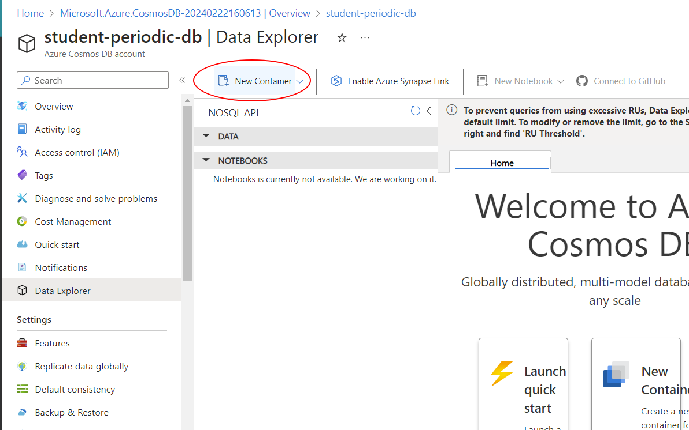

# 0. Introduction

In this tutorial we will set up a database and fill it with records containing information about the periodic table of elements. In a subsequent tutorial, we'll build an API for the public to access this database (without needing to log in to your Azure account 😉).

Specifically, we'll be using a NoSQL database (pronounced "no-seek-well") using Azure's "CosmosDB" service. NoSQL databases are great ways to store 

This guide assumes that you've completed the [VM Workstation tutorial](../workstation). If you haven't, go back and skim through it now. Using a remote VM is not required to do any of the things outlined in this tutorial, but it _will_ make it easier for course staff to help you debug things.

# 1. Get your environment ready

## Portal

TODO description

{}
🔗 [https://portal.azure.com](https://portal.azure.com)
{}

## VSCode

TODO

# 2. Create an empty database

TODO


TODO
- sub: TODO
- rg: TODO
- name: `______-periodic-db` w uwnetid
- location: West US 3 (same as workstation vm, generally a good idea)
- Apply Free Tier Discount: Do **Not** Apply


`Next: Global Distribution >`

- Geo-Redundancy: Disable 
- Multi-region Writes: Disable

`Next: Networking >`

word about security

`Review + Create`

Click blue create button.

Wait a bit and click `Go to resource`:


automatically goes to quickstart, boo. go to data explorer instead:




Choose --
  - Create new database, id `periodic-db`
  - Container id `elements`
  - Partition key `/Period`. Talk about even scaling
  - Max RU/s: 1000. Talk about RU estimation (read ~ 1 RU, write ~5 RUs)
  


Click OK at bottom

If all good:


Let's put some stuff in it!

# 3. Populate the database

TODO

Name folder `db-populate`:


New term


Go into new folder with command:

```bash
cd db-populate
```

Now let's download the [periodic table data](https://gist.github.com/speters33w/e5b1246d6859f29c4f02a299714d4c20) using this terminal command:
```bash
wget https://gist.githubusercontent.com/speters33w/e5b1246d6859f29c4f02a299714d4c20/raw/a78d747534b915c19c5fb6d1fac0df6a77d62452/Periodic%2520Table%2520of%2520Elements.csv -O periodic-table.csv
```
(note that's a capital `-O`)

Now if we open the `periodic-table.csv` file from the files bar on the left, we should see a bunch of raw elemental data:


Let's load it into our database!

New file named `requirements.txt`:


Paste in this text and save:

```python
pandas==2.0.3
python-dotenv==1.0.1
azure-core==1.26.4
azure-cosmos==4.3.1
```

In terminal, install pip

```bash
sudo apt install -y python3-pip
```

Now use pip to install pkgs

```bash
pip3 install -r requirements.txt
```

Yay


Ok new file again. Name it `process.py`:


Plunk in this:

```python
#!/usr/bin/env python3
import sys
import os
import pprint

import dotenv
import pandas as pd
import azure.cosmos.cosmos_client as cosmos_client

dotenv.load_dotenv()

def fail_error(msg):
  sys.stderr.write("\033[1;31m{:}\n".format(msg))
  sys.exit(2)  

try:
  HOST = os.environ['ACCOUNT_HOST']
  MASTER_KEY = os.environ['ACCOUNT_KEY']
except KeyError:
  fail_error("Get your database's account URL and key and set them in the ACCOUNT_HOST / ACCOUNT_KEY environment variables")
DATABASE_ID = "periodic-db"
CONTAINER_ID = "elements"

def dataframe_to_dicts(df):
    for record in df.to_dict(orient='records'):
        yield {k:v for k,v in record.items() if not pd.isna(v)}

def load_data(filename):
    with open(filename, "r") as f:
        data = pd.read_csv(f, true_values=["yes"])
    for col in ["Radioactive", "Natural", "Metal", "Nonmetal", "Metalloid"]:
        data[col] = data[col].replace(pd.NA, False)
    return dataframe_to_dicts(data)

if __name__=="__main__":
    if len(sys.argv) != 2:
        fail_error("Specify input data file to import")
    if not os.path.isfile(sys.argv[1]):
        fail_error("Couldn't find specified input file. Check path/spelling for typos.")

    client = cosmos_client.CosmosClient(HOST, {'masterKey': MASTER_KEY})
    db = client.get_database_client(DATABASE_ID)
    container = db.get_container_client(CONTAINER_ID)
    try:
        for record in load_data(sys.argv[1]):
            record["id"] = record["Element"]
            container.create_item(body=record)
            print("Added {:} ({:}) to db".format(record["Element"], record["AtomicNumber"]))
    except pd.errors.ParserError:
        fail_error("Input file is not in CSV format")
```

Then in the terminal, run the python script with the following terminal command:

```bash
python3 process.py periodic-table.csv
```

If all goes well, you should get this error:


We've gotta tell the python script how to log in to our database! But how? UW NetID and password? _Way_ too insecure. A hacker could register you for the wrong classes.


URIs and Keys:
Make a new file called `.env`, and inside it put the text:

```python
ACCOUNT_HOST=
ACCOUNT_KEY=
```


The `ACCOUNT_HOST` variable is going to point to where on the web our database is located. The `ACCOUNT_KEY` is, effectively, a very long password to that databse. Let's open the Azure portal to retrieve that information.

On the Azure portal, go back to the Cosmos DB dashboard and open your database from the list. Find and open the `Keys` page from the menu on the left (1) . Now copy the URI with the copy button (2) and paste it after `ACCOUNT_HOST=` in the `.env` file. Click the little eye icon next to `PRIMARY KEY` to view the database's access key (3), and then copy that (4). Paste it after `ACCOUNT_KEY=` in the `.env` file:


When you're done, save the `.env` file and try running the script again. If all goes well, you should see messages that all the various elements  were added to the database:


We can confirm this by going to the Azure portal, opening our database's dashboard, and going back to Data Explorer:


From here, if we open the `periodic-db` entry under the NOSQL API list, and then choose `Items`, we should see a listing of all the elements in our database:


Yay! 👩‍🔬⚗️👨‍🔬🧪🧑‍🔬⚛️

# 4. Querying the database

Click the blue `Edit Filter` button and try entering a filter expression into the box, like:

```sql
WHERE c.Phase = "Gas"
```

Click the `Apply Filter` button, to see only the elements that are gaseous at STP: 


You can write complex SQL queries to make arbitrarily selective filters. Here's a refined query that only shows gasses with atomic masses higher than 35:

```sql
WHERE c.Phase = "Gas" AND c.AtomicMass > 35
```

This query language, based on SQL, is quite flexible. Here is an example of a query that will show you all element names that don't end with the letter `n` or suffix `ium`:

```sql
WHERE NOT (c.Element LIKE "%n" OR c.Element LIKE "%ium")
```

You can sort results using an `ORDER BY` clause:

```sql
ORDER BY c.AtomicNumber
```

And choose the number of results with an `OFFSET/LIMIT` clause (the below will select 2 elements, starting _after_ atomic number 6)

```sql
ORDER BY c.AtomicNumber OFFSET 6 LIMIT 2
```

For more detail about how to refine these filters, see the [official documentation](https://learn.microsoft.com/en-us/azure/cosmos-db/nosql/query/).

{}

🏆 **Challenge:**
- Write a query that identifies the most massive element that was discovered before the year 1900.

{}