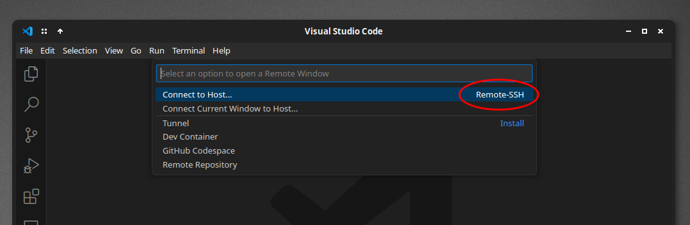
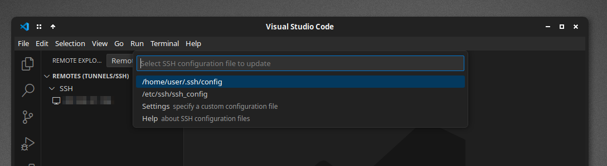
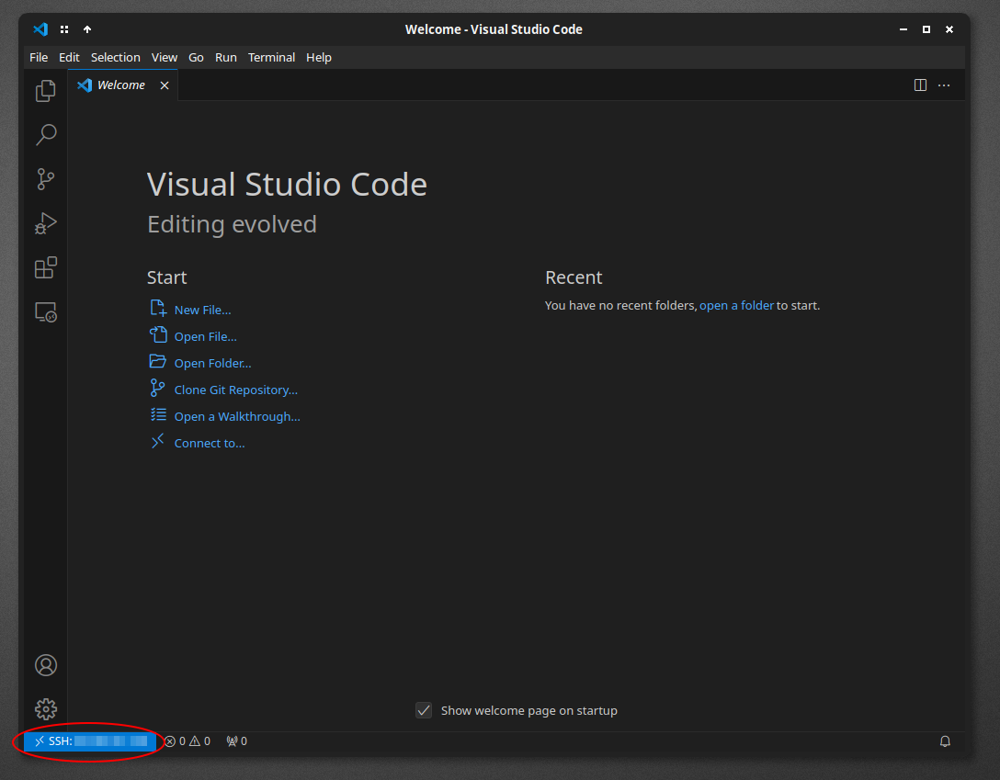

# 0. Introduction

This guide sets up a virtual machine (VM) in the Azure cloud. We use VSCode Server to log in; and from that point
we can write and run code remotely. You use this *remote workstation* through the remaining cloud tutorials. 

You could do this on your laptop *without* the remote workstation, but doing things this way offers advantages:

- Everyone in this class will be using the same type of virtual machine, so if you run into any problems your classmates (and course staff) will be more able to help you debug them. It doesn't matter if you're on a Windows PC, an old Mac, or a new Mac. The commands all run on the remote machine, not your laptop.

- You can access your workstation from any computer with VSCode, which is invaluable if, say, you're travelling and lose your computer. Everything is still in the cloud.

- If you make mistakes and the workstation becomes irreperably screwed up, you can always just delete it and make a new one without affecting all of your laptop's personal files.

This guide assumes that you have [VSCode](https://code.visualstudio.com/) installed on your computer and a UW NetID you can use to log in to Azure. If you don't have VSCode yet, go ahead and install it now.

# 1. Open the Azure portal

There are a few different ways to manage your cloud VMs (and other cloud resources). Today we'll be using the **web portal**, which lets you do things like create, start and stop machines through an app in your web browser. Later, we'll learn how to do similar things using a **CLI**, which works by typing commands out in a terminal.

Navigate to the main Azure Portal page with the below link. When prompted to sign in, **use your UW email address**, after which you can log in with your UW NetID and password.

{}
🔗 [https://portal.azure.com](https://portal.azure.com)
{}

# 2. Creating a VM

In the top search bar of the Azure Portal, search for "virtual machine" (1) and select the "Virtual machines" service from the results (2):


Click the `+Create` button (1) and then select `Azure virtual machine` from the menu (2):


From here, we'll be presented with a configuration screen asking us to choose various options:


    
On this page, configure these options as such:

- **Subscription**: Your course staff should announce to you what subscription to use. If you're not sure, ask them.
- **Resource group**: Choose the pre-existing resource group that contains your UW NetID in the name. It will look something like `rg-amlclass-[YOUR UW NETID]`.
- **Virtual machine name**: Name the machine `[YOUR UW NETID]-workstation`, replacing `[YOUR UW NETID]` with your net ID
- **Region**: This setting determines where (geographically) in the world our machine will be placed. It doesn't ultimately matter for us, but wherever possible try to create all of your cloud resources in one region. This keeps communication between them faster, more reliable, and in some cases cheaper.
- **Availability options**: Choose `No infrastructure redundancy required`. Redundancy options allow us to reserve "backup" VMs in case the primary one becomes unavailable. For our purposes, this isn't necessary (and can make it harder to create the VM), so we opt out of it.
- **Size**: This setting controls how powerful the virtual machine is. The default setting, while good for data science, is likely way too over-powered for what we'll be using it for here. We can choose something much cheaper (around $8/month, instead of around $70/month). Click `See all sizes`:


From the size screen, type `b1s` (1) into the search box and select the `B1s` machine type from the search results below (2). Finally, click `Select` at the bottom of the page (3):


{}
**🙀Note!🙀**

As you do your work in this lab, you may find your terminals freeze up and you are unable to save files. You may even see an error window pop up that says `Operation timed out`. If this happens, it might be because your VM is just a little bit too small. Thankfully, on the cloud, it's easy to [resize the machine later](#resizing-the-vm). Just keep this option in mind as you do your work.
{}

Leave the rest of the settings on this page as-is and click the `Next: Disks >` button at the bottom.

Leave the disk settings as is and click the `Next: Networking >` button.

Leave the disk settings as is and click the `Next: Management >` button.

Scroll down and check the `Enable auto-shutdown` box, which will allow us to set up a timer that always shuts the machine down at a specific time every day. This is incredibly useful for avoiding paying for the machine while we're not using it.

In the options that appear after checking the box, **make sure to set the Time zone to your current location `(UTC-08:00) Pacific Time (US & Canada)`**

You can also fill in an email address to get a reminder that the machine is about to be shut off, though you can uncheck the Notification box if you don't want to provide your contact information:


When done, scroll to the bottom of the page and click `Review + create`.

On the final review page, click the blue `Create` button at the bottom.

<a id="download-pem-file"></a>
You will be prompted to create and download a key file. Click the blue button, which will automatically download a "PEM" file to your computer. Think of this file as your virtual machine password: you'll use it later to log in remotely from your laptop. **Keep this file around, you'll need it later to log in to your VM, and can't download it again.**


Azure will now take a minute or two to create the VM. When it's done, you should see a green checkmark and a 'Go to resource' button. Click that to view machine details.

{}
⛔ **If this step fails** ⛔

If VM creation fails, you'll see a red X instead of a green checkmark and no `Go to resource` button. Check out this guide's [troubleshooting section](#deployment-failure) for tips on what to do next.
{}


From this page we can turn the machine off/on, and view details like its public IP address (the name we use to find it on the internet). You can also get back to this dashboard page from the main Virtual Machines dashboard, which we navigated to at the beginning of this tutorial:


<a id="record-public-ip"></a>
At this point, your VM is ready to connect to with VSCode. Note down the **Public IP address** on the right side of the dashboard. It takes the form of four numbers separated by dots, like `__.__.__.__`. You'll need it in the next steps:


# 3. Setting up the login details for your VM 

Open up VSCode and find the blue `><` button at the bottom-left of the window (circled here in red). This is the button we use to open a new code window that is "remotely conneted" to our VM:


A selection menu will pop up. Select the option that contains the phrase `SSH`. The first time you do this, it may look like this:


On subsequent times that you repeat this process, it will likely instead look like _this_:



Next, VSCode will ask for the remote computer to connect to. Select `+Add New SSH Host...` to add your virtual machine:


In the next box, we will enter the username and IP address for our remote VM. Enter it in the form `azureuser@__________`, where the blank `____` is replaced with the public IP address of your VM that you <a href="#record-public-ip" target="_blank">noted down earlier</a>. Hit enter when you're done:


VSCode will ask where to save the settings you just configured. Choose the first option in the list (which might be different than the below screenshot, that's fine):


Now we have to tell VSCode to use <a href="#download-pem-file" target="_blank">that key file we downloaded</a>. Start by using the `File` menu to `Open Folder`:


In the dialog box that opens, navigate to and select the folder you downloaded that PEM file into (likely your Downloads folder). You may be asked if you trust the authors of the files in this folder. Check the box `Trust the authors of all files in the parent folder`, and then click the `Yes` button:


You should now be able to see the PEM file by opening the browser pane on the left (1). Right-click that file (2) and select Copy Path (3):


Now, open up the remote machines list by clicking the little screen icon on the left side of VSCode (circled and labelled (1) below). Then, move your mouse over the SSH list and click the little gear icon (circled and labelled (2) below):


Select the first item in the menu that pops up (which may look different than in the screenshot below):



This will open up your SSH configuration file in a text editor. There may be more content in the file than the below screenshot, but you ultimately want to find the indented portion of text labelled `Host _________`, where the blank `____` is your VM's IP address.

We need to add a line of the form:
```bash
  IdentityFile "______________________"
```

Where the blank `________` is replaced with the path of the PEM file that you just copied to the clipboard. Note that the line **begins with two spaces**, so that it is "indented" to the same level as the other surrounding lines in the config file. Also note the double quotes `"` around the path you fill in. An example is shown below, highlighted in the red box:


If you're having trouble with this step, **ask your course staff for help**.

When you're done editing the config file, save it by using the file menu's `File > Save`.

# 4. Opening a remote VSCode window

At this point, everything should be set up properly. Now, whenever you want to open a new coding window connected to your remote machine, click the blue `><` button in the bottom left:


Select the option mentioning SSH:


And then select your VM's IP address:


A new window will oppen immediately. The first time you do this, you may be asked if you want to continue after being presented wtih a "fingerprint" value. Confirm you do by selecting the `Continute` option:


After a few moments, if all is successful, you'll see `SSH: __.__.__.__` in the corner of the window, where `__.__.__.__` is the VM's IP.




{}
⛔ **If this step fails** ⛔

If you can't connect VSCode to your VM, there could be a number of problems. Here are some troubleshooting guides:

- [VSCode can connect, but keeps freezing up](#freezing-up-mid-work)
- [VSCode can't connect at all: Error “Permission denied (publickey)”](#error-permission-denied-publickey)
- [VSCode can't connect at all: Error “The connection timed out”](#taking-a-long-time-to-connect)

{}

Finally, to view the files on this remote machine, select `File > Open Folder`:


Leave the text in the file box unmodified and click 'Ok':


The first time you do this, you'll be asked if you trust the authors of the files in this folder. Check the box `Trust the authors of all files in the parent folder`, and then click the `Yes` button:


And finally, after all of the above steps, you'll be able to see all of your remote code files in the 'files' pane on the left:


At this point, all files you edit in this window, and all terminals you open, will inherently be stored and running on the remote machine (rather than your laptop). Congratulations, you are working in the cloud!

# 5. Play around

In your remote window, open a terminal by using the `Terminal` menu and selecting `New Terminal`:


At the bottom of the window, a terminal will open up. We're going to install some software on the remote machine now using the tool `apt`. Run the following command to get `apt` to fetch the list of all the software available for it to download:

```bash
sudo apt update
```


Next, we'll install pip and venv with the following line:

```bash
sudo apt install -y python3-pip python3-venv
```

`Pip` is a tool used to install Python libraries, while `venv` is a tool to help install multiple versions of a python library at one time. We'll be using these tools in future tutorials.

And finally, we're going to install a very important tool called `nyancat`. To do so, run the following command:

```bash
sudo apt-get install -y nyancat
```

Now, you can launch the tool by running the following command:

```bash
nyancat
```

If all goes well, you should see this:


Congratulations! Good job! You're doing science now. You can exit `nyancat` by clicking inside the terminal and typing the key combination `Control + C`. 

# 6. Turning things off when you're done

Although we've set up the machine to automatically power down at the end of the day, it's good practice to manually turn the machine off when you're done using it (the auto-off is really just there in case we forget).

You can power the VM down by going to its dashboard on the Azure web portal and hitting the Stop button:


# 7. Troubleshooting
<a id="perma-troubleshooting"></a>

## Deployment Failure

When you're creating a new VM, the process can fail after you click the blue `Create` button. The resulting screen may look something like this:


Depending on the error, this could be for a number of reasons:

### Error "`ZonalAllocationFailed`"

The error code `ZonalAllocationFailed` means that there are (currently) no unused VMs of the size we selected in the region we selected. We can fix this problem by restarting the VM creation process and *choosing a different region*. You'll find that option on the first page of the VM creation wizard:


## Error "Permission denied (publickey)"

When connceting to a remote machine, you may encounter an error with the message "Could not establish connection...Permission denied (publickey)". It'll look something like this:


If this occurs, a few things could be causing the problem. Click 'More Actions...', then hold the `Control` key and click the `Output log...` link in the terminal at the bottom of the screen:


Scroll up in the error output log at the bottom of the window until you find the text `azureuser@________: Permission denied (publickey).` It'll look something like the red-circled text below:


- If the error text around this reads `UNPROTECTED PRIVATE KEY FILE`, follow the instructions in the [Unprotected Key File](#unprotected-key-file) section of this document.
- If the error text reads `no such identitiy`, `No such file or directory`, or `bad configuration options`, follow the instructions in the [Double-checking file paths](#double-checking-file-paths) section of this document.

### Unprotected key file

If connecting to the remote machine fails with error text that includes the message `UNPROTECTED PRIVATE KEY FILE`, you'll have to tweak your key file's "permissions" so that other users on your computer won't be able to use the file.

Close the remotely connected VSCode window, and return to the normal VSCode window that was open before. Use the file menu's `File > Open Folder` to open the folder containing your PEM file again. Right click the PEM file in the files list and select `Open in Intergrated Terminal`:


Now enter the following command, where the blank `_______` is replaced with the filename of your pem file:

```bash
chmod 0400 _________
```

The command should complete without any output. Now retry opening the remote connection window with the blue `><` button.

### Double-checking file paths

If connecting to the remote machine fails with error text that includes messages like `no such identitiy`, `No such file or directory`, or `bad configuration options`, chances are the key file is incorrectly specified in your ssh configuration.


Close the remotely connected VSCode window, and return to the normal VSCode window that was open before. Re-open your SSH config file by opening the "remote machines" tab on the left, and clicking the gear icon on the SSH row:


Select the first item in the menu that pops up (which may look different than in the screenshot below):


And now double-check a few things:
  - There is a line that starts with the text `IdentityFile` underneath the line `Host __.__.__.__`, where `__.__.__.__` corresponds to your VM's IP address
  - The text following `IdentityFile` is enclosed with double-quotes `"`
  - The text within the quotes is the correct path to your key file that ends with `.pem`, and that you haven't moved the file to another location on your computer 


If you make any changes, make sure to save the file when you're done.

If it's not obvious what the problem is here, ask your course staff for help.

## Taking a long time to connect

If connecting to your VM takes a long time and then fails with the message "The connection timed out", check the sections below for possible causes.


### VM on/off

Our guide has us set up VMs to automatically power off at the end of the day. It may be the case your machine has automatically turned off. Take a look at your VM's dashboard on Azure's web portal. If its status is not "Running", click the "Start" button to turn the machine on:


### Public and private IPs

Double-check that you're using your VM's current public IP address. This is the set of four numbers separated by dots, which you can find in a few places on your VM's dashboard. Make sure you're **not using the private IP**, which starts with the number `10`:


If you need to change your machine's IP in VSCode, close the remotely connected VSCode window, and return to the normal VSCode window that was open before. Re-open your SSH config file by opening the "remote machines" tab on the left, and clicking the gear icon on the SSH row:


Select the first item in the menu that pops up (which may look different than in the screenshot below):


Now, change the IP address listed next to both the `Host` and `HostName` lines (indicated in the screenshot below):


Make sure to save the file when you're done.

## Freezing up mid-work

### Resizing the VM

If your workstation keeps "freezing up" in the middle of your work (you can't run new terminal commands or save code files you're editing), the VM size may be too small. Thankfully, it's easier to make the VM bigger on the cloud.

From the VM's dashboard on the web portal, turn the machine off by clicking the `Stop` button:


Within a minute or two, your machine should finish powering off. Once it has, select the `Size` option from the `Availability + scale` menu on the left:


From here, you can select a new machine size and click the blue `Resize` button at the bottom to make the change. We recommend trying out the size `B2s`, which is still relatively inexpensive but big enough to do your work without freezes. *Be very careful* which size you select here, as selecting the wrong one could burn a lot of money very quickly. Try `B2s`, and if that doesn't work, talk to your course staff.


Once you've resized the VM, go back to the main dashboard page and click `Start` to turn the machine on again:


